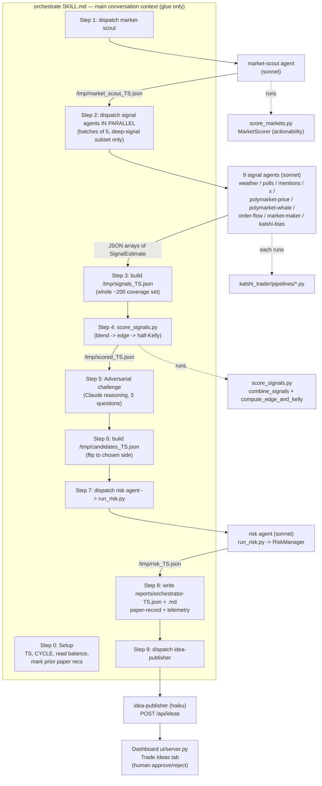
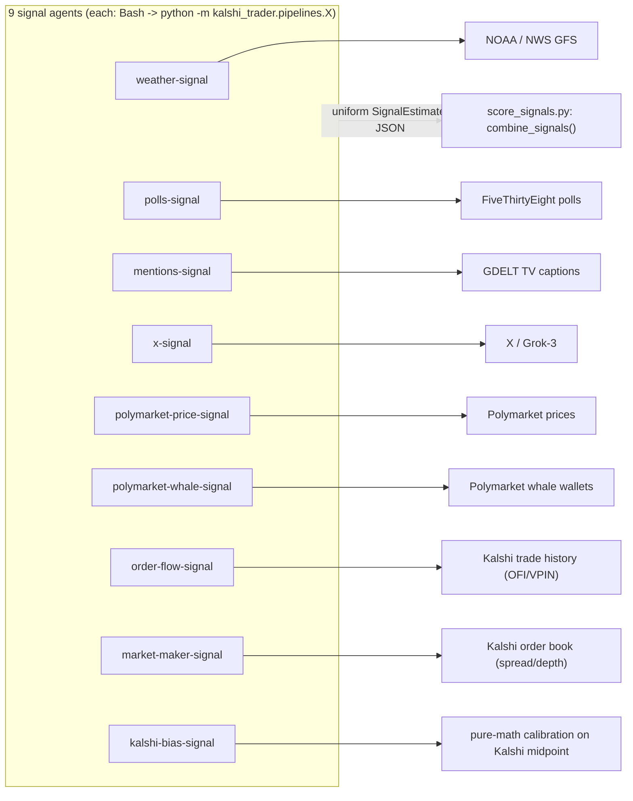

# Research: Agent Structure & Trade-Idea Evaluation Pipeline

**Date**: 2026-06-03T08:21:20-05:00
**Researcher**: Alexandra Lewis
**Git Commit**: 4cefa83b6c458f85a39d92674ac97c1b100d2da1
**Branch**: main
**Repository**: peak6-labs/ai_week

## Research Question
Explain the agent structure and how each component comes together to evaluate trade ideas. Use diagrams where applicable.

## Summary

The system is a **read-only, multi-agent trade-idea generator** for Kalshi markets. No agent or script in the pipeline ever places an order; the most that happens is ideas are stored for a human to approve/reject in a dashboard.

The whole thing is orchestrated by **one skill** — [.claude/skills/orchestrate/SKILL.md](.claude/skills/orchestrate/SKILL.md) — which runs **exactly one cycle** from the main conversation context (only the main context can dispatch sub-agents). The skill is *glue only*: it dispatches agents and runs deterministic Python scripts, and never does math or trades itself.

There are **three kinds of agents**, plus deterministic Python that does all the math:

1. **`market-scout`** (entry) — scans the whole Kalshi board, produces an actionability-ranked JSON of ~200 markets.
2. **Nine signal agents** (the "specialists") — each wraps a Python CLI that pulls one external data source (NOAA, FiveThirtyEight, GDELT, Polymarket, X/Grok, Kalshi order flow…) and emits a uniform `SignalEstimate` JSON. Dispatched **in parallel** only to a prioritized subset (~15 markets).
3. **`risk`** and **`idea-publisher`** (exit) — `risk` applies hard limits + half-Kelly sizing; `idea-publisher` POSTs the surviving slate to the dashboard.

Between dispatch and risk, two deterministic things happen: **`score_signals.py`** blends signals into a fair probability and computes edge/Kelly, and an **adversarial challenge** step (Claude reasoning, not a script) gates each survivor through five questions.

A key architectural fact: the agents themselves do *no math*. Each signal agent is a thin shell that runs a Python module and relays its JSON. All probability, edge, and sizing math lives in deterministic Python (`score_signals.py`, `risk.py`), so it is reproducible and auditable.

> **Stale-path note (documentation fact, not a defect to fix):** every signal-agent definition file and the SKILL.md hardcode the repo root as `/Users/scorley/code` (a different developer's checkout). The Python module paths (`kalshi_trader.pipelines.*`) are correct; only the literal `cd`/absolute prefix in the agent prose differs from this machine's `/Users/llewis/ai_week`. Several signal-agent docs also say their pipeline is "not yet implemented" / "return `[]` on ModuleNotFoundError," but the backing modules (`order_flow.py`, `market_maker.py`, `kalshi_bias.py`) **do** exist in the repo.

---

## The big picture (one cycle)



The same flow as a linear data pipeline, showing the artifact handed off at each stage:

```
 market-scout        signal agents x9        score_signals.py      adversarial      risk agent           idea-publisher
 (actionability)     (parallel, ~15 mkts)    (edge + Kelly)        challenge        (limits+Kelly)       (HTTP POST)
      |                     |                      |                   |                |                    |
 live_markets.json -> market_scout_TS.json -> signals_TS.json -> scored_TS.json -> candidates_TS.json -> risk_TS.json -> orchestrator-TS.json -> dashboard
   (~58k -> ~200)        (~200 rows +           (whole ~200        (survivors:      (side flipped     (approved+sized)   (approved slate)      (pending_ideas)
                          deep-subset signals)   coverage set)      worth_trading     to confidence/
                                                                    & n_sources>=2)   market_price)
```

---

## Detailed Findings

### 1. The orchestrator (the glue)

**File:** [.claude/skills/orchestrate/SKILL.md](.claude/skills/orchestrate/SKILL.md) (446 lines). Invoked by `/orchestrate`, or repeated on a cadence with `/loop 20m /orchestrate` — the skill itself runs exactly one cycle and owns no sleep loop ([SKILL.md](.claude/skills/orchestrate/SKILL.md#L436-L445)).

Every cycle is stamped `TS=$(date -u +%Y%m%dT%H%M%SZ)` and `CYCLE` = line count of `reports/cycle-log.txt` + 1 ([SKILL.md:42-44](.claude/skills/orchestrate/SKILL.md#L42-L44)). Artifacts are keyed by `TS` and handed step-to-step:

| Artifact | Producer | Consumer |
|---|---|---|
| `/tmp/market_scout_<TS>.json` | market-scout (Step 1) | Steps 2, 3, 4 |
| `/tmp/rules_<TS>.json` | `scripts/market_rules.py` (Steps 1, 5) | Steps 2, 5 |
| `/tmp/signals_<TS>.json` | Write tool (Step 3) | `score_signals.py` (Step 4) |
| `/tmp/scored_<TS>.json` | `score_signals.py` (Step 4) | Steps 5, 6, 8 |
| `/tmp/candidates_<TS>.json` | Write tool (Step 6) | risk agent → `run_risk.py` (Step 7) |
| `/tmp/risk_<TS>.json` | Write tool (Step 7) | Step 8 |
| `reports/orchestrator-<TS>.json` | Write tool (Step 8) | idea-publisher (Step 9), paper recording |
| `reports/orchestrator-<TS>.md` | Write tool (Step 8) | human |
| `/tmp/recent_<TS>.json` | Write tool (Step 8) | `scripts/ui_state.py` |

**Step 0 — Setup** ([SKILL.md:38-73](.claude/skills/orchestrate/SKILL.md#L38-L73)): bankroll for sizing is read live from `curl http://localhost:8000/api/state` → `balance_dollars` (falling back to env `KALSHI_BALANCE`, then `1000`). Prior paper recommendations are marked-to-market via `scripts/paper_track.py mark` (read-only P&L update). Telemetry helpers — [scripts/ui_log.py](scripts/ui_log.py#L14) and [scripts/ui_state.py](scripts/ui_state.py#L20) — POST to the dashboard and **swallow all errors so telemetry never blocks the pipeline**.

### 2. Entry — `market-scout` agent

**Agent def:** [.claude/agents/market-scout.md](.claude/agents/market-scout.md) (model `sonnet`; tools `Bash, Read, Write`; strictly read-only). It runs in **pipeline mode** when given an output path: it writes only the JSON and returns a two-line message (path + hot-theme summary), skipping the markdown report ([market-scout.md:37-45](.claude/agents/market-scout.md#L37-L45)).

It executes ([market-scout.md:70-75](.claude/agents/market-scout.md#L70-L75)):
```
KALSHI_ENV=prod PYTHONPATH=. .venv/bin/python scripts/score_markets.py --json --markets-file live_markets.json > $OUTPUT_JSON
```
It is told **not** to refresh the snapshot (`scripts/fetch_markets.py` is forbidden); live signals/orderbooks are re-fetched at score time, so a stale `live_markets.json` is fine.

**Backing math — actionability score (a *screening* score, not edge):** [kalshi_trader/actionability/scorer.py](kalshi_trader/actionability/scorer.py#L31) (`MarketScorer`). It is a weighted average of 9 microstructure signals ([scorer.py:40-50](kalshi_trader/actionability/scorer.py#L40-L50)):

```
relative_historical_volume 0.25   volume_spike_short_term 0.20   price_momentum 0.15
volume_oi_ratio 0.10              oi_change 0.10                 intraday_hl 0.08
ofi 0.07                          weekly_hl 0.04                 orderbook_skew 0.01   (sum = 1.00)
```
`_composite()` ([scorer.py:147-163](kalshi_trader/actionability/scorer.py#L147-L163)) re-normalizes over only the present signals and returns `0.0` below `MIN_COVERAGE = 0.30`. Final `composite_score = raw_composite_score * spread_penalty_multiplier` — a liquidity penalty (1.0 for ≤2¢ spread down to 0.50 for one-sided books) baked directly into the rank.

The scanner that feeds it — [kalshi_trader/scanner.py](kalshi_trader/scanner.py#L43-L59) (`MarketScanner`) — filters to `SCORED_CATEGORIES` (elections, politics, entertainment, climate/weather, mentions, economics, sci/tech), blocks equity prefixes, and requires `open_interest >= 100 and volume_24h >= 10`.

**Output schema (per event row)** — built by `serialize_event_group` in [kalshi_trader/grouping.py:57-126](kalshi_trader/grouping.py#L57-L126). Each row carries microstructure fields plus, critically, **two deterministic `signal_estimates` already computed at scan time with no extra API calls** ([grouping.py:82-97](kalshi_trader/grouping.py#L82-L97)):
- `microstructure` — directional nudge off the market price.
- `kalshi_bias` — calibration correction (favorite-longshot / political underconfidence).

These ride the whole board for free; the nine network-bound agents are reserved for the deep-signal subset.

### 3. The signal agents (the specialists)

There are **nine** signal agents in [.claude/agents/](.claude/agents/). Every one is a thin, read-only wrapper that shells out to a Python CLI under [kalshi_trader/pipelines/](kalshi_trader/pipelines/) and emits a JSON array of `SignalEstimate` objects on stdout (`[]` on no-signal/error — **never fabricated**).



**The shared output contract** — every agent emits objects serialized by `estimate_to_dict()` ([kalshi_trader/agents/parsing.py:62-79](kalshi_trader/agents/parsing.py#L62-L79)) from the `SignalEstimate` dataclass ([kalshi_trader/models.py:125-136](kalshi_trader/models.py#L125-L136)):

```python
{
  "source":         str,    # provenance tag, unique per signal type
  "probability":    float,  # 0.0-1.0 fair YES probability
  "uncertainty":    float,  # std / error band
  "weight":         float,  # how much to trust this source
  "data_issued_at": str,    # ISO-8601 UTC (drives staleness decay)
  "metadata":       dict,   # source-specific; always has ticker, narrative, data_quality
}
```
This uniform shape is exactly what lets nine very different data sources feed one combiner.

| Agent | `source` tag | Data source / backing module | Applies to |
|---|---|---|---|
| [weather-signal](.claude/agents/weather-signal.md) | `noaa_gfs` | NOAA/NWS via [signals/weather.py:96-103](kalshi_trader/signals/weather.py#L96-L103) (`scipy.stats.norm` around forecast) | weather/climate |
| [polls-signal](.claude/agents/polls-signal.md) | `fivethirtyeight` | 538 polls; `norm(margin, 6.0).sf(0)`, weight 0.75 ([signals/polls.py:86-93](kalshi_trader/signals/polls.py#L86-L93)) | elections |
| [mentions-signal](.claude/agents/mentions-signal.md) | `gdelt_mentions` | GDELT TV base rate, weight 0.55 ([signals/mentions.py:77-84](kalshi_trader/signals/mentions.py#L77-L84)) | "will X say a word" |
| [x-signal](.claude/agents/x-signal.md) | `x_grok_*` (4 strategies) | X/Grok-3 search loop ([signals/x.py:56-71](kalshi_trader/signals/x.py#L56-L71)) | politics/sports/crypto/news |
| [polymarket-price-signal](.claude/agents/polymarket-price-signal.md) | `polymarket_price` | Polymarket implied prob; metadata `gap_cents`, `match_score` ([signals/polymarket.py:45-58](kalshi_trader/signals/polymarket.py#L45-L58)) | any cross-venue market |
| [polymarket-whale-signal](.claude/agents/polymarket-whale-signal.md) | `polymarket_whale` | size-weighted whale positions ([signals/polymarket.py:138-150](kalshi_trader/signals/polymarket.py#L138-L150)) | liquid (`vol_24h>5000`) |
| [order-flow-signal](.claude/agents/order-flow-signal.md) | `order_flow` | OFI + VPIN from Kalshi trades; `0.5 + ofi*scale`, weight 0.70 ([order_flow_agent.py:255-274](kalshi_trader/agents/order_flow_agent.py#L255-L274)) | liquid (`vol_24h>5000`) |
| [market-maker-signal](.claude/agents/market-maker-signal.md) | `market_maker` | spread widening + depth withdrawal ([market_maker_agent.py:231-247](kalshi_trader/agents/market_maker_agent.py#L231-L247)) | liquid (`vol_24h>5000`) |
| [kalshi-bias-signal](.claude/agents/kalshi-bias-signal.md) | `kalshi_bias` | pure-math calibration on the midpoint ([kalshi_bias_agent.py:116-133](kalshi_trader/agents/kalshi_bias_agent.py#L116-L133)) | all markets |

> `microstructure` and `kalshi_bias` are **not** dispatched as agents in Step 2 — they already arrive on every scout row from Step 1.

### 4. Dispatch matrix — which agents run for which market (Step 2)

The deep-signal subset (≤ ~15 markets, chosen by category/volume/score) is processed in **batches of 5; within a batch all applicable agents are spawned in a single message so they run concurrently** ([SKILL.md:139-203](.claude/skills/orchestrate/SKILL.md#L139-L203)).

```
every market in batch  -> polymarket-price-signal
category ~ weather     -> weather-signal
elections keywords     -> polls-signal
"mentions" markets     -> mentions-signal
politics/sports/crypto -> x-signal
volume_24h > 5000      -> polymarket-whale-signal, order-flow-signal, market-maker-signal
sports markets         -> sportsbook-odds-signal   (backed by pipelines/sportsbook.py)
```
Agent status is pushed to the dashboard (`running` before a batch, `idle` + `last_signal_count` after).

### 5. Building the signal file & deterministic edge scoring (Steps 3-4)

**Step 3** ([SKILL.md:207-249](.claude/skills/orchestrate/SKILL.md#L207-L249)): the orchestrator writes `/tmp/signals_<TS>.json` for the **entire ~200-market coverage set** — each market starts from its scout `signal_estimates` (microstructure + kalshi_bias) and **appends every estimate** returned by the dispatched agents.

**Step 4** runs the deterministic edge engine — **all probability/edge/Kelly math lives here**, [scripts/score_signals.py](scripts/score_signals.py):
```
PYTHONPATH=. python scripts/score_signals.py --signals-file /tmp/signals_TS.json --config runtime_config.json > /tmp/scored_TS.json
```

Per market:
1. **`usable_estimates()`** ([:323-367](scripts/score_signals.py#L323-L367)) drops non-informative estimates (`uncertainty >= 0.99`) and absence-inferred ones (`data_quality == "empty"`, `post_count == 0`); derives `data_age_minutes` from `data_issued_at`.
2. **`collapse_source_families()`** ([:383-415](scripts/score_signals.py#L383-L415)) merges multi-slice families (e.g. the four `x_grok_*`) into one source so one upstream call isn't counted as several.
3. **`combine_signals()`** ([:222-256](scripts/score_signals.py#L222-L256)) — a **staleness-discounted weighted average**:
   - effective weight `eff_w = weight * exp(-age_minutes / 360)` (≈6h decay scale)
   - `combined_probability = Σ(eff_w · probability) / Σ(eff_w)`
   - **disagreement penalty:** if prob spread > 0.10, `uncertainty += spread * 0.5`
   - no signals → returns `0.5 / uncertainty 1.0 / n_sources 0`
4. **`compute_edge_and_kelly()`** ([:259-320](scripts/score_signals.py#L259-L320)):
   - side selection: YES if `combined_probability >= yes_price` else NO (NO priced as the complement)
   - `edge_cents = side_probability*100 - side_price*100`
   - Kalshi fee `= 0.07 * side_price*(1-side_price)*100`; `fee_adjusted_edge = edge - fee`
   - **half-Kelly:** `full_kelly = (p·b − q)/b` where `b = 1/side_price − 1`; `kelly = max(0, full_kelly * 0.5)`
   - gates: `worth_trading = fee_adjusted_edge > min_edge_cents (5¢) AND entry_price <= max_entry_price_cents (90¢)`
5. **Zero-source guard** ([:460-462](scripts/score_signals.py#L460-L462)): if `n_sources == 0`, edge is forced to 0 so no edge is fabricated from the default 0.5.

**Survivor filter** ([SKILL.md:268](.claude/skills/orchestrate/SKILL.md#L268)): keep `worth_trading == true` **AND** `n_sources >= 2`.

### 6. Adversarial challenge (Step 5) — the reasoning gate

This is **Claude reasoning, not a script** ([SKILL.md:282-313](.claude/skills/orchestrate/SKILL.md#L282-L313)). Settlement rules are fetched (`scripts/market_rules.py`) for any survivor not already in the deep subset, then each survivor must pass five questions before reaching the candidate slate:

1. **Settlement rule** — does the market resolve on what the title implies, and does any cross-venue signal reference the *same* criterion? (A slate resting only on `microstructure` + `kalshi_bias` is weak — they're price-derived and correlated; prefer an independent agreeing signal.)
2. **Bear case** — what mechanism makes the signal wrong?
3. **Source independence** — orthogonal sources, or shared input?
4. **Base rate** — does history support the direction?
5. **Fresh-eyes test** — would you act with no prior conviction?

Each pass/fail is logged via `scripts/ui_log.py`.

### 7. Building candidates & the axis flip (Step 6)

For each survivor, `/tmp/candidates_<TS>.json` is written with the yes/no axis flipped to the chosen side, so the risk script measures edge as `confidence − market_price/100` ([SKILL.md:318-344](.claude/skills/orchestrate/SKILL.md#L318-L344)):
- **YES side:** `confidence = combined_probability`, `market_price = yes_ask`
- **NO side:** `confidence = 1 − combined_probability`, `market_price = 100 − yes_bid` (taker cost to buy NO)

This step exists specifically to translate the Step-4 side selection into the `confidence`/`market_price` axis that `RiskManager` expects — there are **two independent edge computations** (Step 4 and Step 7) and they must agree on the side.

### 8. Exit — `risk` agent + half-Kelly sizing (Step 7)

**Agent def:** [.claude/agents/risk.md](.claude/agents/risk.md) (model `sonnet`; tools `Bash, Read`; analysis only). It runs:
```
PYTHONPATH=. python scripts/run_risk.py --ideas-file IDEAS_FILE --balance BALANCE
```
[scripts/run_risk.py](scripts/run_risk.py) builds a `PortfolioState`, constructs a `TradeIdea` per input, calls `RiskManager.check_trade`, and echoes each idea augmented with `approved`, `approved_size_dollars`, `rejection_reason` — accumulating approved exposure across the batch.

**`RiskManager.check_trade`** ([kalshi_trader/risk.py:26-78](kalshi_trader/risk.py#L26-L78)) applies hard limits from [config.py:35-43](kalshi_trader/config.py#L35-L43), in order:

```
1. daily loss limit      pnl <= -$100              -> reject (system paused)
2. total exposure        >= $400                   -> reject
3. per-category exposure >= $250                   -> reject
4. settlement proximity  < 2h to close (if passed) -> reject
5. minimum edge          confidence - price < 0.05 -> reject (insufficient edge)
6. size = half-Kelly, clamped to category headroom, total headroom, $100 max
7. minimum position      size < $10                -> reject (too small)
   else -> RiskDecision(approved, size, fees_estimate_cents)
```

**Half-Kelly sizing** ([risk.py:116-127](kalshi_trader/risk.py#L116-L127)):
```python
b = (1 - market_prob) / market_prob          # net odds on YES
full_kelly = (probability*b - (1-probability)) / b
half_kelly = max(full_kelly / 2.0, 0.0)
if consecutive_losses[category] >= 3:         # extra cooldown
    half_kelly *= 0.5                          # -> quarter-Kelly
return half_kelly * balance                    # dollars
```
A per-category loss/win streak tracker ([risk.py:107-114](kalshi_trader/risk.py#L107-L114)) halves the next size after 3 consecutive losses.

### 9. Exit — `idea-publisher` & the dashboard (Steps 8-9)

Step 8 writes the approved slate to `reports/orchestrator-<TS>.json` (+ a human `.md` table) and records paper trades. Step 9 dispatches the **`idea-publisher`** agent ([.claude/agents/idea-publisher.md](.claude/agents/idea-publisher.md), model `haiku`, tools `Bash, Read`) — a one-shot "read file + single HTTP POST" agent that POSTs the ideas array to `http://localhost:8000/api/ideas`.

**The dashboard** is a FastAPI app, [kalshi_trader/ui/server.py](kalshi_trader/ui/server.py), launched by [run_ui.py](run_ui.py) on `0.0.0.0:8000`. Key routes ([server.py:88-260](kalshi_trader/ui/server.py#L88-L260)):

```
GET  /                      -> templates/index.html
GET  /api/state             -> full TradingState (balance, positions, ideas, agent_statuses)
POST /api/state             -> merge pipeline telemetry (cycle_number, agent_statuses, ...)
POST /api/log               -> append event-log line
POST /api/ideas             -> assign uuid, append to state.pending_ideas   <-- publish target
POST /api/ideas/{id}/approve-> move to reviewed_ideas, persist to Supabase
POST /api/ideas/{id}/reject -> move to reviewed_ideas, persist to Supabase
GET  /api/ideas/history     -> paper-trade marks timeline
```

Ideas land in `state.pending_ideas` ([ui/state.py](kalshi_trader/ui/state.py)), render in the **Trade Ideas tab** ([ui/templates/index.html:1164](kalshi_trader/ui/templates/index.html#L1164)), and a human clicks approve/reject — which persists to the Supabase `reviewed_ideas` table with `paper_only=True` always ([db.py:186-221](kalshi_trader/db.py#L186-L221)). **No order is placed anywhere.**

> **Two web apps exist.** The writable one above is the orchestrator's POST target. A separate, strictly read-only portfolio monitor lives at [kalshi_trader/dashboard/app.py](kalshi_trader/dashboard/app.py) — it refuses to start if any non-GET route is registered ([app.py:51-64](kalshi_trader/dashboard/app.py#L51-L64)) and only serves GET endpoints. The pipeline does not target it.

---

## The trade-idea object, end to end

```
Step 6 candidate  ──▶  Step 8 orchestrator-TS.json  ──▶  POST /api/ideas  ──▶  approve/reject
{ticker, side,         {+ suggested_size_dollars      {+ id (uuid),          {+ decision,
 confidence,            from risk, selection_summary}   in pending_ideas}      reviewed_at,
 market_price,                                                                 -> Supabase
 reasoning,                                                                    reviewed_ideas
 signal_sources,                                                              (paper_only=true)}
 category, agent_id}
```

---

## Code References

- `.claude/skills/orchestrate/SKILL.md` — the 9-step orchestration glue (all dispatch + script invocation)
- `.claude/agents/market-scout.md` — entry agent; runs `scripts/score_markets.py`
- `.claude/agents/{weather,polls,mentions,x,polymarket-price,polymarket-whale,order-flow,market-maker,kalshi-bias}-signal.md` — the 9 specialists
- `.claude/agents/risk.md` / `.claude/agents/idea-publisher.md` — exit agents
- `scripts/score_markets.py` + `kalshi_trader/actionability/scorer.py` — actionability (screening) score
- `kalshi_trader/grouping.py:57-126` — scout output JSON (incl. inline microstructure + kalshi_bias estimates)
- `kalshi_trader/models.py:125-136` — `SignalEstimate` dataclass (the shared signal contract)
- `kalshi_trader/agents/parsing.py:62-79` — `estimate_to_dict` serializer
- `scripts/score_signals.py:222-320` — `combine_signals` + `compute_edge_and_kelly` (the edge math)
- `scripts/run_risk.py` + `kalshi_trader/risk.py:26-127` — risk checks + half-Kelly sizing
- `kalshi_trader/config.py:35-43` — hard risk limits
- `kalshi_trader/ui/server.py:88-260` — dashboard API incl. `POST /api/ideas`
- `kalshi_trader/scanner.py` / `kalshi_trader/client.py` — market data + async Kalshi client

## Architecture Documentation

Patterns observed in the current codebase:

- **Agents are shells; math is deterministic Python.** Every signal/risk agent only runs a CLI and relays JSON; all probability/edge/Kelly/risk math is in `score_signals.py` and `risk.py`, making it reproducible and testable independent of the LLM.
- **Uniform signal contract** (`SignalEstimate`) lets nine heterogeneous data sources feed a single weighted combiner.
- **Two-tier signal coverage:** cheap deterministic signals (microstructure, kalshi_bias) ride the whole ~200-market board for free at scan time; expensive network-bound agents are reserved for a ≤15-market deep subset, dispatched in parallel batches.
- **Artifact-passing between stages** via `TS`-stamped `/tmp/*.json` files, with a deterministic-script step between most agent steps.
- **Defense-in-depth gating** before any idea is surfaced: `worth_trading` + `n_sources>=2` (Step 4) → adversarial 5-question challenge (Step 5) → independent risk edge gate + sizing (Step 7).
- **Read-only by construction:** no code path in the pipeline calls `create_order`; the terminal state is "stored for human approval," persisted `paper_only=true`.
- **Non-blocking telemetry:** `ui_log.py`, `ui_state.py`, `persist_cycle.py`, and paper-tracking mirror calls all swallow exceptions.
- **One cycle per skill run;** cadence is delegated to `/loop`.

## Historical Context (from thoughts/)

- [thoughts/shared/research/2026-06-02-project-summary.md](thoughts/shared/research/2026-06-02-project-summary.md) — describes the scorer pipeline, the 9 actionability signals with weights, candle cache (SQLite, 23h/55min TTLs), and the half-Kelly risk thresholds. Notes a "6-specialist + 1-coordinator multi-agent architecture that the scorer is intended to feed; the agent layer is currently placeholder" — written before the current agent/orchestrate layer was filled in.
- [thoughts/shared/research/2026-06-02-kalshi-market-scoring-latency.md](thoughts/shared/research/2026-06-02-kalshi-market-scoring-latency.md) — latency analysis of the scan/score phases.
- `plans/trading_plan.md` (referenced by the summary doc) — the original 6-specialist (A1–A6) + coordinator (A7) design, Kelly formula `f* = (p·b − q)/b` capped at half-Kelly, and the two-phase roadmap (human approval gate first, autonomous later). The live agent roster (9 signal agents + scout + risk + publisher) is the realized form of that design.
- `kalshi_trader/actionability/README.md` — documents the two-step scoring pipeline and the spread-penalty multiplier.

## Open Questions

- The repo-root prefix (`/Users/scorley/code`) and several "pipeline not yet implemented" notes in the signal-agent docs are stale relative to the current code (modules exist and the path is `/Users/llewis/ai_week`). This research documents the code as it runs; reconciling the agent prose was out of scope.
- Two edge computations exist (Step 4 `compute_edge_and_kelly` and Step 7 `RiskManager`), both with a 5¢ bar and half-Kelly; Step 6's axis flip is what keeps them aligned. Their precise interplay under disagreement was documented structurally but not exercised here.
